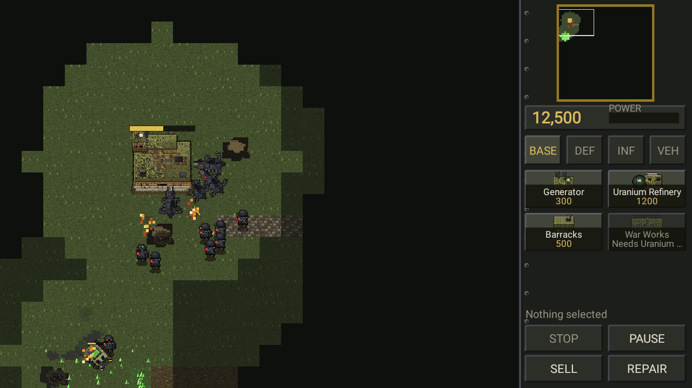

# C&C: Wolfenstein

A Command & Conquer–style real-time strategy game for Android, written in Java, set in the
Wolfenstein universe: the **Kreisau Circle** resistance against the **Totenkopf Division**,
fighting over the uranium seams of Kreisau Valley.

An open-source fan project. Base building, harvesting, tech prerequisites, power, fog of war,
sell and repair, a weapon-versus-armour counter system and a skirmish AI that builds, defends,
repairs and sends attack waves — all on a touchscreen.

The two sides do not mirror each other. The Regime fields fewer unit types, each tougher and
dearer. The Resistance answers with the thing that makes their fiction work: they **steal the
Regime's tech and switch it off** — hijacking vehicles outright, sabotaging structures and
freezing walkers, and moving unseen until they fire.



> **Art.** Every pixel is generated by code in this repository — there are no image files, and
> nothing is traced from or extracted from any id Software or Bethesda release. The art is
> original work *in* the series' idiom: black lacquered armour with one hot red accent,
> brutalist concrete, VGA-era shading. Regime iconography is an original skull mark; there is
> no Nazi insignia in this project and there will not be.

## Building

```bash
# The simulation core: no Android SDK required
./gradlew :core:test

# The Android app (needs an SDK; set ANDROID_HOME or local.properties)
./gradlew :app:assembleDebug      # -> app/build/outputs/apk/debug/app-debug.apk
./gradlew :app:installDebug       # onto a connected device
```

`settings.gradle.kts` only includes `:app` when an Android SDK is reachable, so `:core` builds
and tests on a plain JDK machine with no SDK installed.

## Playing it

Landscape, one skirmish against the AI on Kreisau Valley. You are the Resistance.

| Gesture | Effect |
|---|---|
| Tap a unit or structure | Select it |
| Drag one finger | Rubber-band select |
| Tap the ground with a selection | Move there (or attack a hostile, or harvest a seam) |
| Long press the ground | Attack-move there |
| Drag two fingers | Pan the camera; pinch to zoom |
| Tap or drag the minimap | Jump the camera |
| Sidebar button | Queue a unit or structure; long press cancels and refunds |
| Sidebar button marked READY | Arm placement, then tap the ground to site the structure |
| Tap a structure, then the ground | Set its rally point |
| SELL, then tap a structure | Sell it back for half its cost, scaled by how intact it is |
| REPAIR, then tap a structure | Pay by the instalment to patch it up |
| Infiltrator selected, tap an enemy vehicle | Hijack it — permanently, and the Infiltrator is spent |
| Saboteur selected, tap a structure or walker | Switch it off for a while |

**Asymmetry, in practice.** A hijacked Sturmpanzer is the only heavy tank the Resistance will
ever field, and it costs them a 600-credit Infiltrator to take one. A sabotaged generator
produces no power and a sabotaged War Works produces nothing at all, which is how six partisans
take a position that would eat sixty. Stealthy units are untargetable while they hold still and
hold fire; step into their reveal radius, or wait for them to shoot, and they are just infantry
again. Anything switched off takes a cold cast and arcs visibly, so both players can see it.

**Power matters.** A shortfall does not switch the base off — it slows every production line,
*and takes your defences offline entirely*. Bombing generators is a real strategy, in both
directions. **Primary factory:** with two barracks, select one to choose where recruits appear.

The economy is the usual loop: harvesters mine uranium seams, drive it back to a refinery, and
that becomes credits. Seams regrow slowly, so a long match cannot deadlock with two broke
players staring at each other. You lose when you have nothing left standing and nothing alive.

### Order of battle

Structures are shared. The Command Post is pre-placed; everything else needs it standing.

| Structure | Cost | Notes |
|---|---|---|
| Generator | 300 | +100 power |
| Uranium Refinery | 1200 | Arrives with a free harvester |
| Barracks | 500 | Infantry |
| War Works | 1500 | Vehicles and harvesters; needs a refinery |
| Flak Turret | 600 | General purpose; outranges every mobile unit; dies with the power |
| MG Nest | 350 | Cheap, anti-infantry only |
| Pak Gun | 700 | Anti-vehicle; poor against infantry; needs a War Works |

**Kreisau Circle** — six infantry, improvised and specialised, plus what they steal.

| Unit | Cost | Role |
|---|---|---|
| Partisan | 120 | Rifle line infantry |
| Panzerschreck Team | 300 | Anti-armour |
| Grenadier | 280 | Thrown charges with a blast radius — the answer to massed Soldaten |
| Marksman | 350 | Long range, brutal against infantry, useless against plate. Stealthy |
| Saboteur | 450 | Unarmed. Disables a structure or freezes an Ubersoldat |
| Infiltrator | 600 | Unarmed. Hijacks an enemy vehicle permanently. Stealthy |
| Scout Jeep | 400 | Fast, thin-skinned |
| Captured Panzer | 1000 | Heavy armour |

**Totenkopf Division** — four infantry, heavy and expensive, and the armour to match.

| Unit | Cost | Role |
|---|---|---|
| Soldat | 110 | Line infantry |
| Scharfschütze | 420 | Counter-sniper. Stealthy |
| Sturmpionier | 500 | Flamethrower — shreds infantry and structures, dies to anything at range |
| Ubersoldat | 800 | Armoured walker |
| Panzerhund | 500 | Fast mech-hound |
| Sturmpanzer | 900 | Heavy tank. The Resistance has no equivalent — and every reason to steal one |

Both sides also build the Harvester (1000).

Rifles shred infantry and bounce off plate; rockets do the reverse; sniper rounds are savage
against flesh and near-useless against anything plated. The whole matrix lives in
`DamageTable`, and every stat lives in `UnitType` and `BuildingType` — those three files are
the entire balance surface.

## How it is put together

```
core/   plain Java, zero Android imports — simulation, rules, AI
app/    Android application — art, rendering, HUD, touch input
```

### The seam

The Android layer never reaches into the simulation. Everything crosses one boundary:

| Direction | Mechanism |
|---|---|
| UI → game | `PlayerCommand` submitted to `CommandBus`, which validates and returns a reason on rejection |
| game → UI | `WorldView` for queries, `GameEvent` for things that happened |

That is why the whole game can be driven from a test with no screen attached, and why
`CommandBusTest` can play a build-place-train loop through commands alone.

| Package | What lives there |
|---|---|
| `core.api` | The command vocabulary, the bus, the read-only view |
| `core.sim` | `GameWorld` — the authoritative fixed-step simulation |
| `core.map` / `core.path` | Tiles, the `.map` format, 8-way A*, occupancy |
| `core.entity` / `core.combat` | Units, structures, stat tables, the damage matrix |
| `core.ai` | The skirmish opponent |
| `app.art` | Palette, pixel canvas, sprite recipes, the baked atlas |
| `app.render` | Camera, world renderer, HUD, minimap |
| `app.fx` | Particles, ground decals, projectiles, and the director that drives them |

`GameWorld` steps at a fixed 20 Hz and is deterministic for a given seed. The renderer
interpolates between ticks, so the simulation rate is invisible on a 60 or 120 Hz screen.

### The art pipeline

Sprites are recipes, not files. `PixelCanvas` provides the pixel-art primitives (bevel,
dithered ramps, seeded speckle, outline, supersampled rotation) and `SpriteFactory` bakes every
unit facing, walk frame, structure damage state, terrain variant and effect frame into bitmaps
once at startup. Infantry are drawn per facing so the helmet stays on top; vehicle hulls are
drawn once and rotated, because a hull genuinely does rotate.

## Running and testing without a device

```bash
./gradlew :core:run --args="--ticks 24000 --seed 7 --difficulty VETERAN"
```

Plays a full AI-versus-AI match as fast as the CPU allows and prints a scoreboard every
simulated minute — the quickest way to see whether a balance change changed anything.

```bash
./gradlew :core:test                # 82 tests: rules, pathfinding, economy, the seam
./gradlew :app:testDebugUnitTest    # 26 tests: camera maths, plus Robolectric rendering
```

The app tests **render real frames and every sprite** into `app/build/test-frames/*.png` —
contact sheets of the whole sprite set, and in-game frames. On a build machine with no
emulator, reviewing those PNGs is the art and layout review, and it has caught plenty:
vehicles torn apart by naive rotation, a harvester whose hopper read as a hole, buttons running
off the bottom of the screen, and a build ghost buried under a green wash. The effects layer
gets the same treatment: `EffectsContactSheetTest` lays every weapon class from muzzle to
impact, every death staged over time, every ground mark fresh through faded and every particle
kind side by side, which is how blood decals were caught drawing as a solid brick and
explosions as grey cauliflowers with their own fire buried underneath.

## Status

**Part 1, the base game, is complete**: the full C&C loop — build, harvest, produce, fight,
sell, repair, win — behind a formal command seam, with the whole visual layer rebuilt.

**Part 2 is complete**: real rosters for both sides, the Resistance's asymmetric toolkit
(hijack, sabotage, stealth), splash damage and two new weapon classes, two new defences, a
four-tab sidebar, and a combat effects layer with its own visual language per weapon.

Balance after the roster change, over ten seeds of forty simulated minutes each: Kreisau 3,
Totenkopf 5, two that ran the clock out. Both of those were live attrition — full economies,
eleven structures a side, twenty units in the field — not an economic deadlock.

**Part 3 is the air layer**: helicopters, AA weapons, air-only defences. Then, each its own
part: audio, campaign and mission scripting, more maps, save/load, veterancy and stances,
multiplayer.
